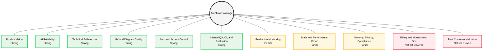

# Archflow Coverage Map

This file shows where Archflow is already strong, where it is partially covered, and where it is still not fully built or proven.

How to read it:

- `Strong` means the area is implemented clearly enough to discuss confidently
- `Partial` means the direction is good, but it still needs deeper production proof or more infrastructure
- `Not Yet Covered` means it is either not built or not validated enough to claim strongly

---

## Visual Coverage Web

---

## Coverage Matrix

| Area | Status | What Is Covered | Why It Counts As Covered | What Is Still Missing |
|---|---|---|---|---|
| Product Vision | Strong | Clear user problem, learning-first direction, trust-first product principles, no public score pressure | The app has a real point of view and the product decisions are consistent with it | More live user interviews and paid usage data would strengthen it further |
| AI Reliability | Strong | Structured generation flow, hardened JSON parsing, wrapped/truncated JSON recovery, retry logic, normalization, protocol repair, domain blueprint tuning, failure capture | The app is not blindly trusting raw model output anymore; it has containment, recovery, and deterministic domain-specific correction layers | Model behavior can still drift over time because AI providers change |
| Technical Architecture | Strong | Next.js frontend, Express backend, PostgreSQL, Redis, Clerk, OpenRouter, diagram persistence, version history, autosave logic, transactional save/delete handlers | The system has clear separation of concerns, transaction-safe persistence paths, and real implementation depth across frontend and backend | Very large-scale concurrency and cost behavior are still not deeply proven |
| UX and Diagram Clarity | Strong | Smarter auto-arrange, focused flow inspection, sidebars, connection details, readable tech labels, cleaner controls, demo accordion, opt-in Guided Mode, quick-start empty canvas prompts, scrollable review panel | The product is intentionally designed to reduce confusion rather than just expose more knobs | Extremely dense graphs can still reveal edge-case readability problems |
| Auth and Access Control | Strong | Clerk middleware, protected routes, frontend env guards, local auth smoke verification, protected probe route, access-control tests for diagram update/delete/version flows | Auth is no longer "assumed working"; it has repeatable local verification, route protection, and backend tests around important ownership boundaries | Still dependent on third-party Clerk behavior and future version changes |
| Internal QA, CI, and Evaluation | Strong | Eval harness, prompt matrix, history prompt mining, AI failure logging, Markdown scoreboard, 43 backend tests, frontend lint/typecheck/build, Playwright smoke, GitHub Actions on Ubuntu and macOS | Quality is now measurable internally and automatically checked in CI instead of being judged only by feel | The evaluator will get stronger as more real prompts and failure cases accumulate |
| Production Monitoring | Partial | Build verification, auth smoke checks, migration checks, internal evals, structured backend logging, calmer synthesis failure states | There is a decent pre-ship quality loop already | Full observability like Sentry, alerting, dashboards, and tracing is not yet a mature part of the stack |
| Scale and Performance Proof | Partial | Debounced autosave, queued saves, focused rendering behavior, layout improvements for dense graphs | The app has some performance-aware design choices already | No serious load testing, real traffic proof, or long-session stress proof has been demonstrated yet |
| Security, Privacy, Compliance | Partial | Protected routes, env-based secrets, narrow local-only smoke bypass, structured auth model, high-severity dependency audit gates, upgraded Clerk/Express packages | Basic product security thinking is present, high/critical dependency issues are guarded in CI, and the local bypass was carefully scoped | Formal privacy policy depth, retention controls, compliance posture, enterprise security guarantees, and legal docs are still not deeply built out |
| Billing and Monetization Ops | Not Yet Covered | The product can be sold conceptually and has a plausible pricing direction | The value proposition is strong enough for a paid v1 | Stripe, subscriptions, invoices, quotas, usage enforcement, and billing ops are not implemented yet |
| Real Customer Validation | Not Yet Proven | The product feels ready to ship and has a clear story | It is reasonable to launch and charge as a v1 | There is no real paid user retention, cohort learning, or revenue proof yet |

---

## Area-by-Area Notes

### 1. Product Vision
**Covered:** Yes, strongly.

**Why:** Archflow has a clear identity. It is not trying to be a generic drawing tool or an AI toy. It is trying to help users understand, inspect, and iterate on system architecture in a more trustworthy way.

**What is still missing:** More evidence from real users would help validate whether the current positioning is exactly right, but the product logic itself is strong.

### 2. AI Reliability
**Covered:** Yes, strongly.

**Why:** The app does not just send prompts and hope for good output. It has structured parsing, retries, normalization, domain blueprint tuning, and internal evaluation. That is what makes the AI side feel productized.

**What is still missing:** AI systems always have long-tail weirdness. The system is resilient, but it is not immune to model drift forever.

### 3. Technical Architecture
**Covered:** Yes, strongly.

**Why:** There is real implementation depth here: frontend editor logic, backend persistence, version history, migrations, auth, evaluation, repair flows, structured logging, and transaction-safe diagram save/delete paths.

**What is still missing:** Large-scale production pressure has not yet validated every infrastructure choice.

### 4. UX and Diagram Clarity
**Covered:** Yes, strongly.

**Why:** This is one of Archflow’s strongest areas. The product got much better when the interaction model moved from clutter and hovering toward focused inspection, sidebars, a calmer demo accordion, opt-in guidance, quick-start prompts, scrollable review surfaces, and cleaner defaults.

**What is still missing:** Very dense enterprise-scale diagrams may still need future refinement.

### 5. Auth and Access Control
**Covered:** Yes, strongly.

**Why:** The app has real protected routes, Clerk integration, env checks, a reproducible local smoke verification path, and backend tests around owner/collaborator boundaries.

**What is still missing:** The system still depends on external auth vendor behavior, so dependency drift remains a maintenance concern.

### 6. Internal QA, CI, and Evaluation
**Covered:** Yes, strongly.

**Why:** This is one of the most important strategic strengths. The internal evaluator gives the product a way to improve quality systematically instead of only through intuition, while CI verifies backend tests, frontend lint/typecheck/build, audits, and Playwright smoke coverage on Ubuntu and macOS. The current backend suite has 43 passing tests.

**What is still missing:** More historical data and more real prompt coverage will make the evaluator stronger over time.

### 7. Production Monitoring
**Covered:** Partially.

**Why:** There are good verification loops already, especially before release, and structured backend logging makes future observability easier.

**Why not fully covered:** Observability for a live paid product still needs deeper tooling like error dashboards, alerting, and tracing.

### 8. Scale and Performance Proof
**Covered:** Partially.

**Why:** The editor has been improved with smarter defaults, debouncing, and cleaner rendering behavior.

**Why not fully covered:** The app has not been proven under large real traffic, prolonged editing sessions, or heavy concurrent AI usage.

### 9. Security, Privacy, Compliance
**Covered:** Partially.

**Why:** Basic product security is taken seriously, auth is real, high-severity dependency audit gates are in CI, and access-control behavior has tests.

**Why not fully covered:** Legal/compliance readiness is a different layer from basic app auth, and that layer is not fully built yet.

### 10. Billing and Monetization Ops
**Covered:** Not yet.

**Why:** The product can absolutely be sold, but the operational system for charging people is separate from the product itself.

**What is missing:** Payments, subscriptions, invoices, quota enforcement, and the surrounding support flows.

### 11. Real Customer Validation
**Covered:** Not yet proven.

**Why:** The product is strong enough to launch, but launch-readiness and market-proof are not the same thing.

**What is missing:** Real usage, retention, paid conversion, and feedback loops from actual customers.

---

## Interview Summary

If someone asks, "What parts of this app are strongest right now?" the best answer is:

- product vision
- AI reliability strategy
- technical architecture
- UX clarity
- auth hardening and access-control tests
- CI, audit gates, and internal evaluation

If someone asks, "What is not fully covered yet?" the honest answer is:

- production observability
- scale proof under real traffic
- compliance and legal maturity
- billing operations
- real customer traction

That is a strong place to be for a serious paid v1 product.

---

## 10/10 Maturity Path

The codebase is professionally maintained for a showcase product. The remaining path to "perfect" depends on the goal:

| Goal | Most Important Next Work |
|---|---|
| Global job showcase | 60-second demo video, crisp case study, architecture docs, green CI proof, and a clean public product story |
| Production SaaS | Observability, quotas, cost tracking, billing, privacy/retention controls, real test DB integration coverage, and real customer validation |
| Engineering polish | Stronger TypeScript adoption in core diagram/review/generation contracts, lazy-loaded editor panels, accessibility QA, and large-diagram performance testing |

This keeps the project honest: Archflow is already strong enough to impress as a job-facing build, while the paid-product layer still needs the operational systems that real customers would depend on.
